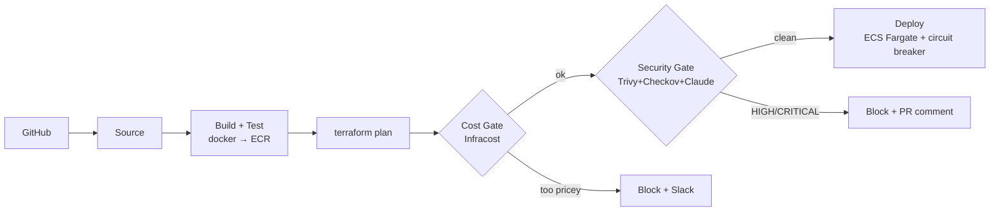

# PipelineGuard

A production-grade, **fully Terraformed** AWS-native CI/CD pipeline for a sample Node.js API,
with two custom quality gates built on Lambda:

- **💰 Cost Gate** — runs [Infracost](https://www.infracost.io/) on every Terraform plan and
  **blocks the deploy** if the projected monthly cost increase exceeds a threshold (default **$50/mo**).
- **🛡️ Security Gate** — runs **Trivy** (container CVEs) + **Checkov** (IaC static analysis), asks
  **Claude** (`claude-haiku-4-5`) to summarise the findings, posts a report as a **GitHub PR comment**,
  and **blocks the deploy** on any HIGH/CRITICAL issue.

> Portfolio project demonstrating **DevOps + DevSecOps + FinOps** in one repo. Nothing is click-ops.

## Architecture



Full diagram and component map: [`docs/architecture.md`](docs/architecture.md).

## Tech stack

| Layer | Tool |
|---|---|
| CI/CD | CodePipeline + CodeBuild |
| Runtime | ECS Fargate behind an ALB |
| Registry | ECR (immutable tags, scan-on-push) |
| Custom gates | Lambda (Python 3.12) |
| Cost | Infracost |
| Security | Trivy + Checkov |
| AI summary | Anthropic Claude (`claude-haiku-4-5`) |
| IaC | Terraform ≥ 1.7 |
| Secrets | Secrets Manager |
| Notifications | Slack webhook + SNS |
| Observability | CloudWatch Logs / Metrics / Alarms |

## Repository layout

```
app/          Sample Express API (the deployed workload) + tests
terraform/    All infra: networking, ecr, ecs, gates, pipeline modules
gates/        Lambda source: cost_gate + security_gate (+ unit tests)
buildspecs/   CodeBuild YAMLs for each pipeline stage
scripts/      bootstrap.sh, deploy-gates.sh, local-scan.sh
docs/         architecture.md, runbook.md
```

## Quick start

```bash
# App
npm ci --prefix app && npm test --prefix app

# Gates (unit tests, no AWS needed)
pip install pytest boto3
pytest gates/cost_gate/tests gates/security_gate/tests

# Local security scan (needs docker + trivy + checkov)
./scripts/local-scan.sh
```

Full deploy walkthrough — remote state bootstrap, Lambda layers, GitHub connection
authorisation — is in [`docs/runbook.md`](docs/runbook.md).

## Setting the cost threshold

`cost_gate_threshold` (USD/month) lives in `terraform/environments/<env>.tfvars`
(default **50** dev / **100** prod). When a `terraform plan` projects a monthly increase
above it, the cost gate calls `PutJobFailureResult`, posts to Slack, and the pipeline stops.
Raise the threshold and re-apply if an increase is intentional.

## Screenshots

> Add these once the pipeline has run in your account:

1. **Cost gate blocking a deploy** — Slack message + blocked stage in CodePipeline.
2. **Security gate blocking a deploy** — the Claude-authored GitHub PR comment.
3. **Green pipeline** — all stages passing end-to-end.

## Estimated monthly cost (dev, ap-southeast-1)

| Resource | Approx. USD/mo |
|---|---|
| NAT Gateway (1) | ~$32 |
| ALB | ~$16 |
| Fargate task (256/512, 1×) | ~$9 |
| ECR / S3 / logs / Secrets | ~$3 |
| CodePipeline + CodeBuild | ~$1 + build minutes |
| **Total (idle-ish)** | **~$60/mo** |

Tear everything down with `terraform destroy` — see the runbook.

## Non-negotiables (enforced in this repo)

Everything is Terraform · least-privilege IAM · secrets only in Secrets Manager ·
default tags on all resources · gates never silently pass · ECS circuit breaker ·
immutable ECR tags · bounded log retention · S3 versioning · typed Python handlers.

## License

MIT — portfolio/demonstration use.
