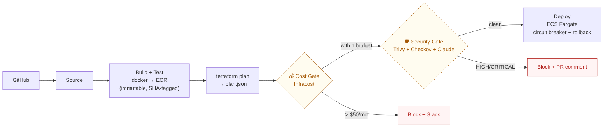
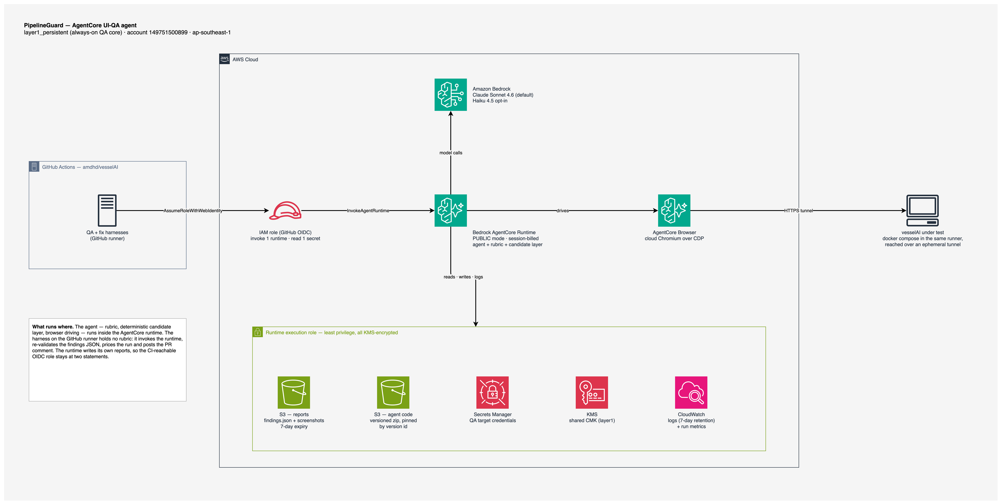

# PipelineGuard

[](LICENSE)

**Delivery guardrails that block a change before it ships — plus a DevOps AI agent that reviews the
running UI on a pull request.**

Two programs, one repo, all of it **Terraform** (zero click-ops):

**1. The pipeline gates.** An AWS-native delivery pipeline for a containerized Node.js API. The
point isn't the app it ships — it's the two custom **quality gates** that halt the pipeline before a
costly or vulnerable change reaches production:

- **💰 Cost Gate** — runs [Infracost](https://www.infracost.io/) on every Terraform plan and
  **blocks the deploy** if the projected monthly cost increase exceeds a threshold (default **$50/mo**).
  Posts the verdict to Slack.
- **🛡️ Security Gate** — runs **Trivy** (container CVEs) + **Checkov** (IaC static analysis), asks
  **Claude** (`claude-haiku-4-5`) to summarise the findings, posts a report as a **GitHub PR comment**,
  and **blocks the deploy** on any HIGH/CRITICAL issue.

**2. The UI-QA agent.** A **Bedrock AgentCore** runtime that drives a cloud browser over the app
under test on a pull request, reports what it finds as a PR comment, and can propose fixes for a
human to review. It is deployed and measured, not a demo script — and its limits are recorded
alongside its results in [`docs/agentcore/EVIDENCE.md`](docs/agentcore/EVIDENCE.md). See
[The UI-QA agent](#the-ui-qa-agent-bedrock-agentcore).

> Portfolio project demonstrating **DevOps · DevSecOps · FinOps** in one repo — platform-level
> guardrails a whole team can rely on, not just "an app I deployed."

**Status:** the QA core runs continuously in `ap-southeast-1` (~$1.40/mo); the demo pipeline is
brought up on demand and torn down between demos — see [Deploy it](#deploy-it).

---

## What it does

Every push runs the pipeline below. Between building the image and deploying it, two Lambda gates
inspect the change and can **fail the run** — that's the whole idea.



Full diagram and component map: [`docs/architecture.md`](docs/architecture.md).

## The UI-QA agent (Bedrock AgentCore)

The gates above read a plan and an image. Neither can tell you the dashboard renders `NaN`. That is
what the agent is for: on a pull request it opens the running app in a cloud browser, works through
the views, and reports what it actually saw.



*Editable source: [`docs/images/agentcore-qa-agent.drawio`](docs/images/agentcore-qa-agent.drawio) ·
walkthrough: [`docs/images/agentcore-qa-agent.md`](docs/images/agentcore-qa-agent.md)*

**Two programs, two places.** The agent — rubric, deterministic candidate layer, browser driving —
runs inside the AgentCore runtime. The harness on the GitHub runner holds no rubric: it invokes the
runtime, re-validates the findings JSON against the schema, prices the run and posts the comment.
The runtime writes its own reports, which is what keeps the CI-reachable OIDC role down to two
statements — invoke one runtime, read one secret.

**The QA target is a separate repo** (`amdhd/vesselAI`, a React/Node app with a documented history
of frontend/backend contract drift). It is brought up from its own `docker-compose.prod.yml` inside
the GitHub runner and exposed through an ephemeral tunnel, so the agent tests a real running stack
without provisioning one per run.

**The parts that keep it honest:**

- **A deterministic candidate layer.** The runtime mechanically detects signals — repeated empty
  SVGs, console errors, failed requests — and the model *must* assess every candidate: `confirmed`
  becomes a finding, `refuted` costs it a one-line reason. The model cannot quietly ignore evidence,
  and the contract is enforced in the schema and the tests.
- **Structured output, validated twice.** Findings are JSON against a schema, validated in the
  runtime and again by the harness before anything is posted.
- **Every run is priced.** The comment carries token cost, session seconds and runner minutes. A
  typical run is **~$0.03–0.28** and finishes in well under a minute; the runtime bills per session
  and nothing while idle.
- **Kill switches in the account, not in the workflow.** `qa_pr_enabled` and `fix_agent_enabled` are
  Terraform variables: flipping one revokes the identity at the account, with no change in the
  target repo.
- **Fix loop, human-gated.** The fix harness proposes edits from the findings, but never commits or
  opens a PR — the workflow does that, after a compile-and-test gate. A separate convergence layer
  decides continue / stall / done and makes no model calls at all.

**What is measured, and what isn't** (full record in
[`docs/agentcore/EVIDENCE.md`](docs/agentcore/EVIDENCE.md)):

| | Result |
|---|---|
| Recall against seeded bugs | **6/9** — two of three seed classes caught 3/3; the third is a written-off miss with the reason recorded, not silently dropped |
| False positives on a healthy branch | **0 findings** on `main` in the best measured pass |
| False-positive rate on real, human-authored PRs | ⚠️ **not measured** — 0 of the 3 labelled PRs the protocol requires |
| Model rungs benchmarked | Sonnet 4.6 vs Haiku 4.5; Sonnet is the default because Haiku missed the semantic seed |

So: it finds real defects on a real app and reports them at a known cost. It is not a replacement
for a QA engineer, and its false-positive rate outside a seeded corpus is still an open number.

## Three disciplines, one repo

| | What proves it |
|---|---|
| **DevOps** | Modular Terraform · CodePipeline/CodeBuild CI/CD · immutable SHA-tagged ECR artifacts · self-healing deploys (ECS circuit breaker + auto-rollback) |
| **DevSecOps** | Shift-left security gate: Trivy scans the image, Checkov scans the IaC, Claude summarises to the PR, HIGH/CRITICAL fails the pipeline |
| **FinOps** | Infracost cost gate blocks budget-busting changes · cost-aware design (single NAT, right-sized Fargate) · destroy-when-idle keeps spend near $0 · every agent run priced in its own PR comment |
| **AI agent ops** | A Bedrock AgentCore runtime deployed and versioned like any other artifact: immutable zip pinned by S3 version id, hash-locked dependency closure, least-privilege execution role, session caps and account-level kill switches, results measured against a corpus rather than asserted |

## Tech stack

| Layer | Tool |
|---|---|
| CI/CD | CodePipeline + CodeBuild |
| Runtime | ECS Fargate behind an ALB |
| Registry | ECR (immutable tags, scan-on-push) |
| Cost gate | Lambda (Python 3.12, zip + Infracost layer) |
| Security gate | Lambda **container image** (Trivy + Checkov + Claude) |
| Cost analysis | Infracost |
| Security scanning | Trivy + Checkov |
| AI summary | Anthropic Claude (`claude-haiku-4-5`) |
| UI-QA agent | Bedrock AgentCore Runtime + AgentCore Browser (PUBLIC mode, session-billed) |
| Agent model | Bedrock — Claude Sonnet 4.6 default, Haiku 4.5 opt-in (inference profiles) |
| Agent CI | GitHub Actions + OIDC role (no long-lived keys) |
| IaC | Terraform ≥ 1.7 |
| Secrets | Secrets Manager |
| Notifications | Slack webhook + SNS |
| Observability | CloudWatch Logs / Metrics / Alarms |

## Repository layout

```
app/          Sample Express API (the deployed workload) + Dockerfile + tests
infra/        All Terraform, two roots: layer1_persistent (KMS + qa_agent) and
              layer2_ephemeral (networking, ecr, ecs, pipeline, gates) — see infra/README.md
gates/        Lambda source: cost_gate (zip) + security_gate (container image, Dockerfile)
agents/       qa/agent    — the UI-QA agent that runs inside AgentCore (rubric, candidates, browser)
              qa/harness  — the GitHub-runner CLI: invoke, validate, price, comment
              fix         — proposes edits from findings (never commits or opens the PR)
              converge    — the loop's stopping rule: continue / stall / done
buildspecs/   CodeBuild YAMLs for each pipeline stage
scripts/      bootstrap · demo-up · demo-down · apply-dev (layer1) · destroy-dev · local-scan
              package-qa-agent · seed-qa-secret · reopen-corpus
docs/         architecture.md, deploy.md, runbook.md
docs/agentcore/  PLAN.md (phased build spec) · EVIDENCE.md (measurements) · AUDIT.md · DISCOVERY.md
```

## Deploy it

Prereqs: Terraform ≥ 1.7, AWS CLI v2 (a profile with admin for setup), Docker, an Infracost API key,
an Anthropic API key, and a Slack webhook.

```bash
export AWS_PROFILE=<your-profile>          # account/region target
export AWS_DEFAULT_REGION=ap-southeast-1

# 0. One-time backend bootstrap (S3 state bucket; locking is S3-native). Writes
#    backend.conf for BOTH layer roots.
./scripts/bootstrap.sh dev ap-southeast-1

# 1. QA core — layer1_persistent (KMS + qa_agent) is applied once and STAYS UP
#    (~$1.40/mo idle). It carries the AgentCore runtime the vesselAI QA workflow
#    invokes. apply-dev.sh uses infra/layer1_persistent/dev.tfvars, which pins
#    qa_agent_code_key / qa_agent_code_version_id ON PURPOSE.
#    On a COLD account the zip does not exist yet and the runtime is count-gated
#    off, so the first bring-up is three steps:
./scripts/apply-dev.sh -var qa_agent_code_key=""   # buckets, roles, secret, KMS
./scripts/package-qa-agent.sh                      # build + upload the agent zip,
                                                   # then commit the printed
                                                   # key/version id into dev.tfvars
./scripts/apply-dev.sh -auto-approve               # creates the runtime

# 1b. QA target credentials, seeded out-of-band for the same reason as the gate
#     secrets below (Terraform owns the container, never the material).
export QA_TARGET_EMAIL="..." QA_TARGET_PASSWORD="..."
./scripts/seed-qa-secret.sh dev ap-southeast-1

# 2. DEMO layer bring-up (layer2_ephemeral: networking + ECR + ECS + ALB +
#    pipeline + gates). Cold-start two-phase inside demo-up.sh (security-gate
#    image first, then the rest + app image). A demo day costs ~$2-3; while down
#    the layer bills ~$0.
./scripts/demo-up.sh -auto-approve

# 3. Seed the gate API keys directly into Secrets Manager. They are deliberately
#    not Terraform variables: `terraform show -json` writes sensitive values into
#    plan.json in plaintext, and plan.json ships as a pipeline artifact to S3.
export INFRACOST_API_KEY="ico-..." ANTHROPIC_API_KEY="sk-ant-..."
export SLACK_WEBHOOK_URL="https://hooks.slack.com/services/..."
./scripts/seed-gate-secrets.sh dev ap-southeast-1

# 4. Authorize the GitHub connection ONCE in the console:
#    Developer Tools → Connections → pg-dev → Update pending connection
#    (AWS exposes no API for the OAuth handshake — this is the only manual step.)

# 5. Between demos, tear the demo layer down (empties ECR repos first so destroy
#    can't hang). This NEVER touches layer1:
./scripts/demo-down.sh -auto-approve

#   destroy-dev.sh instead destroys BOTH layers — only to stop the whole project.
```

Full walkthrough — remote state, the GitHub connection, troubleshooting — is in
[`docs/runbook.md`](docs/runbook.md).

Shipping a change to the agent is its own short sequence: `./scripts/package-qa-agent.sh` builds the
Linux aarch64 zip and prints the new S3 object version id → commit that id into
`infra/layer1_persistent/dev.tfvars` → `./scripts/apply-dev.sh`. A zip bump is an **in-place** update
(the runtime version increments; the ARN holds), so a plan that proposes a replace means something
else is wrong.

## Running the gates (operational notes)

- **How the gates are invoked.** The `CostGate` and `SecurityGate` stages are CodeBuild steps that
  invoke the gate Lambdas and read a `gate_status` from the response (the handlers are dual-mode and
  also support a native CodePipeline action). A failing status makes the stage exit non-zero, which
  stops the pipeline before Deploy. The security gate's Lambda has no source checkout, so the build
  ships the Terraform to S3 for Checkov to scan.
- **CI secrets & backend.** `backend.conf` is git-ignored, so the build regenerates it from the
  account/region. Secrets never reach Terraform at all: `terraform show -json` does not redact
  sensitive values, so a `TF_VAR_*` secret would be written in plaintext into `plan.json` — an
  artifact the pipeline stores in S3. The Infracost / Anthropic / Slack / GitHub values live only
  in Secrets Manager (seeded by `scripts/seed-gate-secrets.sh`) and are read by the gate Lambdas
  at runtime.
- **The security gate is strict by design.** Checkov flags every HIGH/CRITICAL misconfiguration in
  the Terraform, so out of the box the gate **blocks** — the sample infra has open security groups,
  unencrypted buckets, and the like. To let a clean change reach Deploy, either fix/baseline those
  findings (a `.checkov.yaml` skip list) or run the gate in warn-only mode. The strictness is the
  point: it proves the gate actually stops a bad change.

## Quick start (local, no AWS)

```bash
# App
npm ci --prefix app && npm test --prefix app

# Gate handlers + agent/harness unit tests (repo venv, not system python)
.venv/bin/python -m pytest

# Local security scan (needs docker + trivy + checkov)
./scripts/local-scan.sh
```

## Notable engineering decisions

The choices that took real thought — and double as interview talking points:

- **The cost gate measures the *delta*, not the total.** It runs `infracost diff` on the plan (not
  `infracost breakdown`, which never emits a delta field), so it thresholds on the monthly cost
  *increase* a change introduces — the whole point of a cost gate.
- **Security gate is a container-image Lambda, not zip + layers.** Trivy (~160 MB) + Checkov
  (~160 MB) together exceed Lambda's **250 MB unzipped** package limit, so that function is packaged
  as a Docker image (10 GB ceiling). Its image is built with `--provenance=false` — plain `buildx`
  emits an OCI manifest that Lambda rejects; that flag yields the Docker v2 manifest Lambda accepts.
- **One shared NAT Gateway, deliberately.** It's ~60% of idle cost, so for a demo environment it's
  shared across AZs. Production would use one per AZ — a conscious cost-vs-availability tradeoff.
- **Designed for near-zero idle spend.** Two Terraform layers with separate states: the QA core
  (layer1_persistent) stays up at ~$1.40/mo, and the demo stack (layer2_ephemeral) is destroyed
  between demos — NAT + ALB are hourly-rate and can't scale to zero, so "off" means destroyed.
  `demo-down.sh` empties ECR first so `destroy` can't hang and never touches layer1.
- **The agent is deployed like an artifact, not like a script.** The zip lives in its own versioned
  S3 bucket (separate from reports, which expire after 7 days) and the runtime pins one **object
  version id**, committed to `dev.tfvars` — so a deploy is immutable and a rollback is a variable
  change. Its dependency closure is hash-locked and installed with `--require-hashes`, so two
  rebuilds from one commit are byte-identical.
- **Least-privilege everywhere.** Each Lambda and ECS task gets its own IAM role; secrets live only
  in Secrets Manager (never env vars); ECS tasks run in private subnets, reachable only from the ALB.

## Cost (dev, `ap-southeast-1`)

**Layer1 (QA core) — always up:**
| Resource | Approx. USD/mo |
|---|---|
| KMS key (1) | ~$1.00 |
| Secrets Manager (QA secret) | ~$0.40 |
| **Layer1 total** | **~$1.40/mo** |

The AgentCore runtime is PUBLIC-mode and bills **per session**, never while idle; a handful of QA
runs a month adds ~$0.03–0.28 each.

**Layer2 (demo stack) — only while demoing (~$2–3/day):**
| Resource | Approx. USD/day |
|---|---|
| NAT Gateway (1) | ~$1.08 |
| ALB | ~$0.54 |
| Fargate task (256 CPU / 512 MB, 1×) | ~$0.37 |
| ECR · S3 · Secrets · CloudWatch · pipeline | ~$0.10 |
| **Layer2 total** | **~$2.10/day · ~$0 while down** |

Demo a day or two a month and the whole project lands **under $10/mo**. Tear the demo layer down
between demos with `./scripts/demo-down.sh`.

## Setting the cost threshold

`cost_gate_threshold` (USD/month) lives in `infra/layer2_ephemeral/dev.tfvars` (default **$50**).
When a `terraform plan` projects a monthly increase above it, the cost gate returns a failing
`gate_status`, posts to Slack, and the CodeBuild stage exits non-zero so the pipeline stops. Raise
the threshold and re-apply if an increase is intentional.

## Non-negotiables (enforced in this repo)

Everything is Terraform · least-privilege IAM · secrets only in Secrets Manager · default tags on all
resources · gates never silently pass · ECS circuit breaker · immutable ECR tags · bounded log
retention · S3 versioning · typed Python handlers.

## License

MIT — portfolio / demonstration use. See [`LICENSE`](LICENSE).
