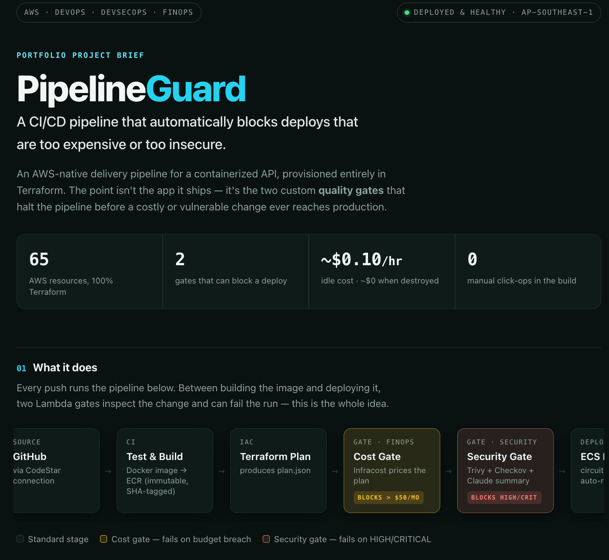
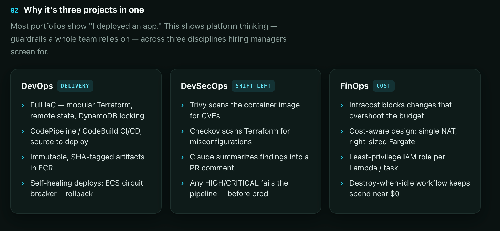
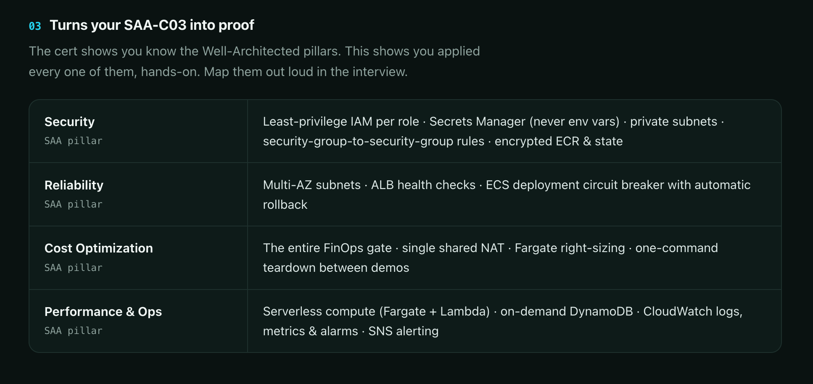
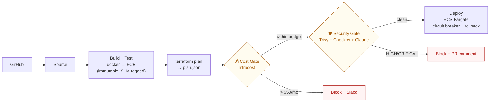

# PipelineGuard

[](LICENSE)

**A CI/CD pipeline that automatically blocks deploys that are too expensive or too insecure.**

An AWS-native delivery pipeline for a containerized Node.js API, provisioned **100% in Terraform**
(zero click-ops). The point isn't the app it ships — it's the two custom **quality gates** that
halt the pipeline before a costly or vulnerable change ever reaches production:

- **💰 Cost Gate** — runs [Infracost](https://www.infracost.io/) on every Terraform plan and
  **blocks the deploy** if the projected monthly cost increase exceeds a threshold (default **$50/mo**).
  Posts the verdict to Slack.
- **🛡️ Security Gate** — runs **Trivy** (container CVEs) + **Checkov** (IaC static analysis), asks
  **Claude** (`claude-haiku-4-5`) to summarise the findings, posts a report as a **GitHub PR comment**,
  and **blocks the deploy** on any HIGH/CRITICAL issue.

> Portfolio project demonstrating **DevOps · DevSecOps · FinOps** in one repo — platform-level
> guardrails a whole team can rely on, not just "an app I deployed."

**Status:** runs in a dev environment (`ap-southeast-1`), brought up on demand and torn down between demos — see [Deploy it](#deploy-it).







---

## What it does

Every push runs the pipeline below. Between building the image and deploying it, two Lambda gates
inspect the change and can **fail the run** — that's the whole idea.



Full diagram and component map: [`docs/architecture.md`](docs/architecture.md).

## Three disciplines, one repo

| | What proves it |
|---|---|
| **DevOps** | Modular Terraform · CodePipeline/CodeBuild CI/CD · immutable SHA-tagged ECR artifacts · self-healing deploys (ECS circuit breaker + auto-rollback) |
| **DevSecOps** | Shift-left security gate: Trivy scans the image, Checkov scans the IaC, Claude summarises to the PR, HIGH/CRITICAL fails the pipeline |
| **FinOps** | Infracost cost gate blocks budget-busting changes · cost-aware design (single NAT, right-sized Fargate) · destroy-when-idle keeps spend near $0 |

## Tech stack

| Layer | Tool |
|---|---|
| CI/CD | CodePipeline + CodeBuild |
| Runtime | ECS Fargate behind an ALB |
| Registry | ECR (immutable tags, scan-on-push) |
| Cost gate | Lambda (Python 3.12, zip + Infracost layer) |
| Security gate | Lambda **container image** (Trivy + Checkov + Claude) |
| Cost analysis | Infracost |
| Security scanning | Trivy + Checkov |
| AI summary | Anthropic Claude (`claude-haiku-4-5`) |
| IaC | Terraform ≥ 1.7 |
| Secrets | Secrets Manager |
| Notifications | Slack webhook + SNS |
| Observability | CloudWatch Logs / Metrics / Alarms |

## Repository layout

```
app/          Sample Express API (the deployed workload) + Dockerfile + tests
infra/        All Terraform: networking, ecr, ecs, pipeline, gates modules (see infra/README.md)
gates/        Lambda source: cost_gate (zip) + security_gate (container image, Dockerfile)
buildspecs/   CodeBuild YAMLs for each pipeline stage
scripts/      bootstrap · demo-up · demo-down · apply-dev (layer1) · destroy-dev · local-scan
docs/         architecture.md, deploy.md, runbook.md
```

## Deploy it

Prereqs: Terraform ≥ 1.7, AWS CLI v2 (a profile with admin for setup), Docker, an Infracost API key,
an Anthropic API key, and a Slack webhook.

```bash
export AWS_PROFILE=<your-profile>          # account/region target
export AWS_DEFAULT_REGION=ap-southeast-1

# 0. One-time backend bootstrap (S3 state bucket; locking is S3-native). Writes
#    backend.conf for BOTH layer roots.
./scripts/bootstrap.sh dev ap-southeast-1

# 1. QA core — layer1_persistent (KMS + qa_agent) is applied once and STAYS UP
#    (~$1.40/mo idle). It carries the AgentCore runtime the vesselAI QA workflow
#    invokes. apply-dev.sh uses infra/layer1_persistent/dev.tfvars, which pins
#    qa_agent_code_key / qa_agent_code_version_id ON PURPOSE.
./scripts/apply-dev.sh -auto-approve

# 2. DEMO layer bring-up (layer2_ephemeral: networking + ECR + ECS + ALB +
#    pipeline + gates). Cold-start two-phase inside demo-up.sh (security-gate
#    image first, then the rest + app image). A demo day costs ~$2-3; while down
#    the layer bills ~$0.
./scripts/demo-up.sh -auto-approve

# 3. Seed the gate API keys directly into Secrets Manager. They are deliberately
#    not Terraform variables: `terraform show -json` writes sensitive values into
#    plan.json in plaintext, and plan.json ships as a pipeline artifact to S3.
export INFRACOST_API_KEY="ico-..." ANTHROPIC_API_KEY="sk-ant-..."
export SLACK_WEBHOOK_URL="https://hooks.slack.com/services/..."
./scripts/seed-gate-secrets.sh dev ap-southeast-1

# 4. Authorize the GitHub connection ONCE in the console:
#    Developer Tools → Connections → pg-dev → Update pending connection
#    (AWS exposes no API for the OAuth handshake — this is the only manual step.)

# 5. Between demos, tear the demo layer down (empties ECR repos first so destroy
#    can't hang). This NEVER touches layer1:
./scripts/demo-down.sh -auto-approve

#   destroy-dev.sh instead destroys BOTH layers — only to stop the whole project.
```

Full walkthrough — remote state, the GitHub connection, troubleshooting — is in
[`docs/runbook.md`](docs/runbook.md).

## Running the gates (operational notes)

- **How the gates are invoked.** The `CostGate` and `SecurityGate` stages are CodeBuild steps that
  invoke the gate Lambdas and read a `gate_status` from the response (the handlers are dual-mode and
  also support a native CodePipeline action). A failing status makes the stage exit non-zero, which
  stops the pipeline before Deploy. The security gate's Lambda has no source checkout, so the build
  ships the Terraform to S3 for Checkov to scan.
- **CI secrets & backend.** `backend.conf` is git-ignored, so the build regenerates it from the
  account/region. Secrets never reach Terraform at all: `terraform show -json` does not redact
  sensitive values, so a `TF_VAR_*` secret would be written in plaintext into `plan.json` — an
  artifact the pipeline stores in S3. The Infracost / Anthropic / Slack / GitHub values live only
  in Secrets Manager (seeded by `scripts/seed-gate-secrets.sh`) and are read by the gate Lambdas
  at runtime.
- **The security gate is strict by design.** Checkov flags every HIGH/CRITICAL misconfiguration in
  the Terraform, so out of the box the gate **blocks** — the sample infra has open security groups,
  unencrypted buckets, and the like. To let a clean change reach Deploy, either fix/baseline those
  findings (a `.checkov.yaml` skip list) or run the gate in warn-only mode. The strictness is the
  point: it proves the gate actually stops a bad change.

## Quick start (local, no AWS)

```bash
# App
npm ci --prefix app && npm test --prefix app

# Gate handlers (unit tests)
pip install pytest boto3
pytest gates/cost_gate/tests gates/security_gate/tests

# Local security scan (needs docker + trivy + checkov)
./scripts/local-scan.sh
```

## Notable engineering decisions

The choices that took real thought — and double as interview talking points:

- **The cost gate measures the *delta*, not the total.** It runs `infracost diff` on the plan (not
  `infracost breakdown`, which never emits a delta field), so it thresholds on the monthly cost
  *increase* a change introduces — the whole point of a cost gate.
- **Security gate is a container-image Lambda, not zip + layers.** Trivy (~160 MB) + Checkov
  (~160 MB) together exceed Lambda's **250 MB unzipped** package limit, so that function is packaged
  as a Docker image (10 GB ceiling). Its image is built with `--provenance=false` — plain `buildx`
  emits an OCI manifest that Lambda rejects; that flag yields the Docker v2 manifest Lambda accepts.
- **One shared NAT Gateway, deliberately.** It's ~60% of idle cost, so for a demo environment it's
  shared across AZs. Production would use one per AZ — a conscious cost-vs-availability tradeoff.
- **Designed for near-zero idle spend.** Two Terraform layers with separate states: the QA core
  (layer1_persistent) stays up at ~$1.40/mo, and the demo stack (layer2_ephemeral) is destroyed
  between demos — NAT + ALB are hourly-rate and can't scale to zero, so "off" means destroyed.
  `demo-down.sh` empties ECR first so `destroy` can't hang and never touches layer1.
- **Least-privilege everywhere.** Each Lambda and ECS task gets its own IAM role; secrets live only
  in Secrets Manager (never env vars); ECS tasks run in private subnets, reachable only from the ALB.

## Cost (dev, `ap-southeast-1`)

**Layer1 (QA core) — always up:**
| Resource | Approx. USD/mo |
|---|---|
| KMS key (1) | ~$1.00 |
| Secrets Manager (QA secret) | ~$0.40 |
| **Layer1 total** | **~$1.40/mo** |

The AgentCore runtime is PUBLIC-mode and bills **per session**, never while idle; a handful of QA
runs a month adds ~$0.03–0.28 each.

**Layer2 (demo stack) — only while demoing (~$2–3/day):**
| Resource | Approx. USD/day |
|---|---|
| NAT Gateway (1) | ~$1.08 |
| ALB | ~$0.54 |
| Fargate task (256 CPU / 512 MB, 1×) | ~$0.37 |
| ECR · S3 · Secrets · CloudWatch · pipeline | ~$0.10 |
| **Layer2 total** | **~$2.10/day · ~$0 while down** |

Demo a day or two a month and the whole project lands **under $10/mo**. Tear the demo layer down
between demos with `./scripts/demo-down.sh`.

## Setting the cost threshold

`cost_gate_threshold` (USD/month) lives in `infra/layer2_ephemeral/dev.tfvars` (default **$50**).
When a `terraform plan` projects a monthly increase above it, the cost gate returns a failing
`gate_status`, posts to Slack, and the CodeBuild stage exits non-zero so the pipeline stops. Raise
the threshold and re-apply if an increase is intentional.

## Non-negotiables (enforced in this repo)

Everything is Terraform · least-privilege IAM · secrets only in Secrets Manager · default tags on all
resources · gates never silently pass · ECS circuit breaker · immutable ECR tags · bounded log
retention · S3 versioning · typed Python handlers.

## Contributing

Setup, the non-negotiables, and the pre-PR checklist are in [`CONTRIBUTING.md`](CONTRIBUTING.md).

## License

MIT — portfolio / demonstration use. See [`LICENSE`](LICENSE).
