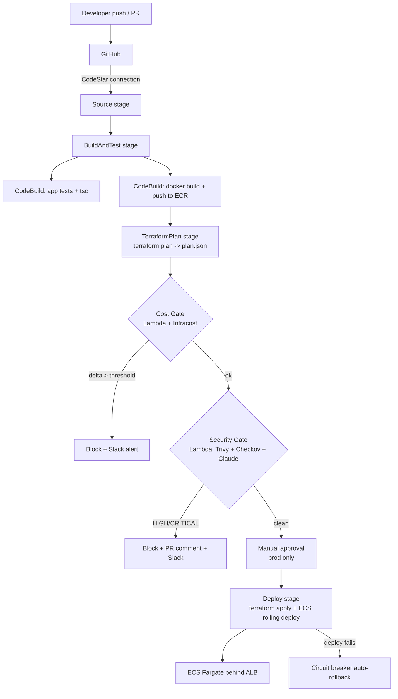

# PipelineGuard — Architecture

## Pipeline flow

## Component map

| Concern | AWS resource | Terraform module |
|---|---|---|
| Networking | VPC, 2 public + 2 private subnets, 1 NAT GW, ALB SGs | `networking` |
| Image registry | ECR (immutable tags, scan-on-push, lifecycle) | `ecr` |
| Runtime | ECS Fargate cluster, service, task def, ALB | `ecs` |
| Custom gates | 2 Lambdas + Secrets Manager + layers + alarms | `gates` |
| CI/CD | CodePipeline, 6 CodeBuild projects, S3 artifacts, CodeStar conn | `pipeline` |

## Gate decision points

- **Cost Gate** — reads the `plan.json` artifact from S3, runs `infracost breakdown`,
  compares `diffTotalMonthlyCost` against `COST_THRESHOLD`. Over threshold ⇒
  `put_job_failure_result` + Slack. Any unhandled error also fails the job (never silent-pass).
- **Security Gate** — Trivy scans the pushed image, Checkov scans the Terraform.
  Claude (`claude-haiku-4-5`) summarises. Any HIGH/CRITICAL ⇒ block + PR comment + Slack.
  Claude failure falls back to raw counts so the gate still decides.

## Security & FinOps posture

- Secrets only in Secrets Manager; Lambdas fetch at runtime via `get_secrets()`.
- Least-privilege IAM per role; each statement is commented with its purpose.
- Default tags (`Project`/`Environment`/`ManagedBy`/`Owner`) on every resource for cost allocation.
- ECR immutable tags + Git-SHA tagging ⇒ deterministic rollback.
- ECS deployment circuit breaker with rollback ⇒ self-healing deploys.
- Log retention capped (7d dev / 30d prod). Single NAT GW keeps dev cost down.
